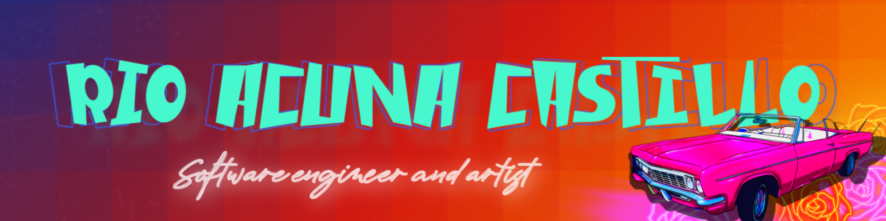

### Hi, my name is Rio 👋

I’m a software engineer with <a href="https://resilientcoders.org">Resilient Coders</a>. I'm a Peruvian non-binary person, raised in NYC, currently living in Pittsburgh, PA. I believe in the simplicity of radical truth-telling and believe that tech and art teach us about the vastness of creation. My intent as a software engineer is to deliver powerful, accessible products that can foster real connection. As someone who was raised in the country and outside of it, I saw the ways that the phone and internet could travel across time and lands. 

As someone who has had parents incarcerated at a young age, I understood the power that technology could hold over keeping a family together. I want to dig my feet in to the infinite possibilites of what tech could do for people. Whether it's providing real human connection, or figuring out how users can best relate to a product, I am determined, detail-oriented, and an asset to any team I am apart of.

See more on <a href="https://riocastillo.netlify.app">my portolio</a>!
  

  

	
	
	
  
  

## Relevant Skills 
Coding: HTML & CSS | JavaScript 

Art: Adobe Illustrator | Screenprinting | Graphic Design

Languages: English, Spanish, Quechua

 

